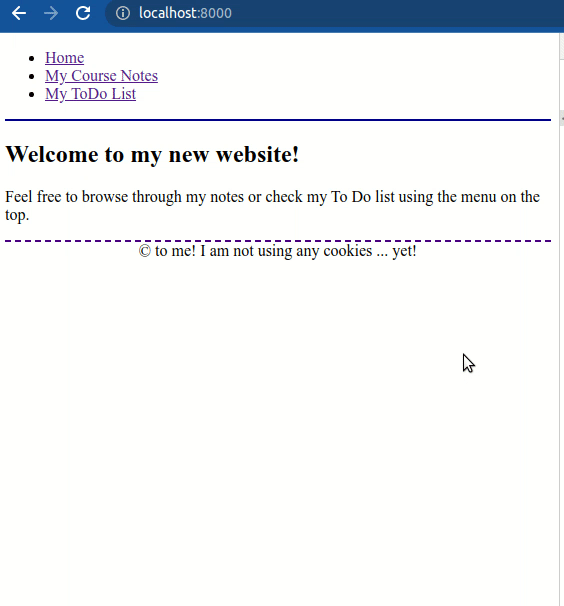
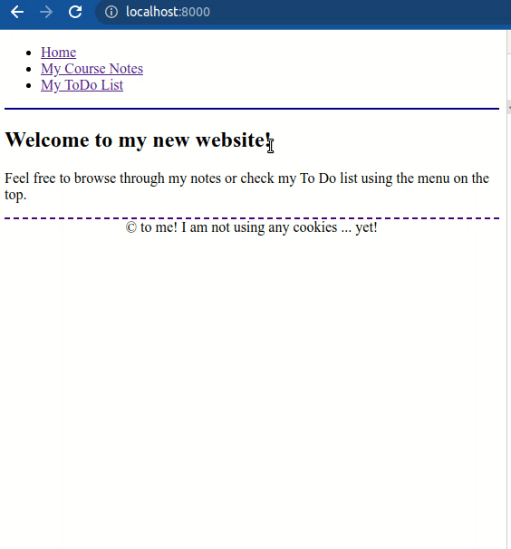
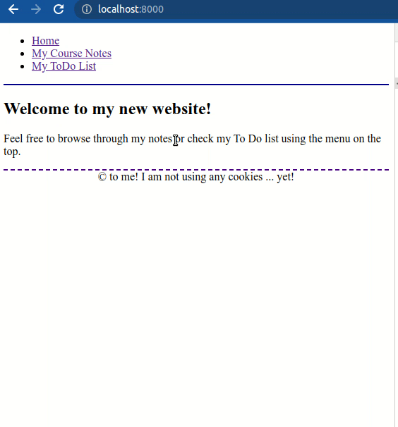

# Django-forms-mkskh Exercise-Project 

## This is a continuation of previous project - [Django_views-and-templates](https://github.com/mkskh/Django_views-and-templates-mkskh/tree/main) 

## Consists of 4 tasks:

### task1

### task2

### task3

### task4

